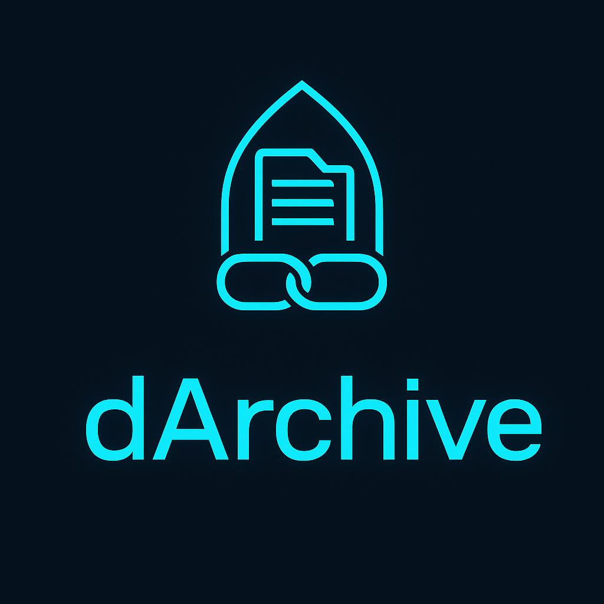

# dArchive - Bad News for Fake News

In the age of AI, fakes news has become a huge problem. The dArchive addresses this by providing a easy way to register media assets on the blockchain. No more tempering with news articles.

The dArchive project is based of the algorand [full stack example](https://examples.dev.algorand.co/python-fullstack/)

## Prerequisites

- Python 3.12 or later
- Docker (required for LocalNet)
- AlgoKit CLI (2.0.0 or later)
- Poetry (1.2 or later)

## Quick Start

### Frontend

- Development server: `cd frontend && npm run dev`
- Run tests: `npm test`
- Build: `npm run build`

### Backend

- Fast API server: `cd api && poetry run uvicorn src.main:app --reload --host 0.0.0.0 --port 8001`
- Run tests: `poetry run pytest tests`

## Links

- submission on [dorahacks](https://dorahacks.io/buidl/32521)